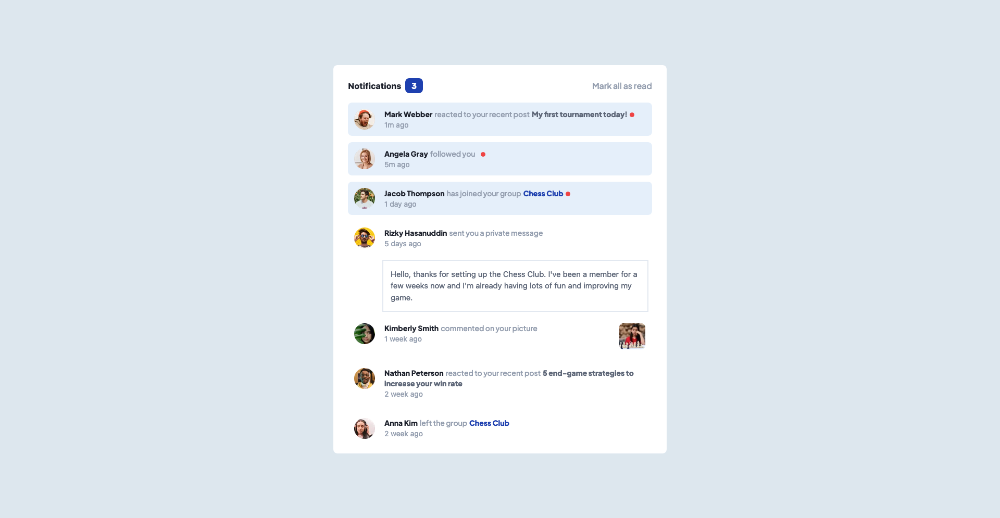
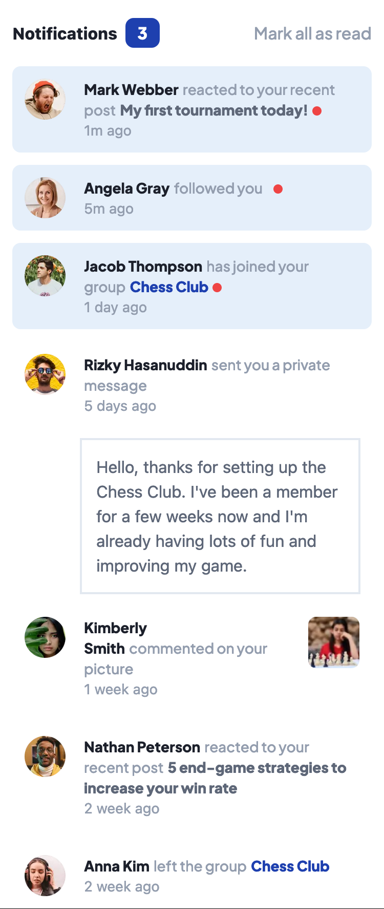

# Frontend Mentor - Notifications page solution

This is a solution to the [Notifications page challenge on Frontend Mentor](https://www.frontendmentor.io/challenges/notifications-page-DqK5QAmKbC). Frontend Mentor challenges help you improve your coding skills by building realistic projects.

## Table of contents

- [Overview](#overview)
  - [The challenge](#the-challenge)
  - [Screenshot](#screenshot)
  - [Links](#links)
- [My process](#my-process)
  - [Built with](#built-with)
  - [What I learned](#what-i-learned)
  - [Continued development](#continued-development)
  - [Useful resources](#useful-resources)

## Overview

### The challenge

Users should be able to:

- Distinguish between "unread" and "read" notifications
- Select "Mark all as read" to toggle the visual state of the unread notifications and set the number of unread messages to zero
- View the optimal layout for the interface depending on their device's screen size
- See hover and focus states for all interactive elements on the page

### Screenshot

|  |  |
| --------------------------------------------------------- | -------------------------------------------------------- |

### Links

- [My Solution]()
- [Live Site URL]()

## My process

### Built with

- Semantic HTML5 markup
- CSS custom properties
- Flexbox
- CSS Grid
- Mobile-first workflow
- Tailwind CSS
- Javascript
- [React](https://reactjs.org/) - JS library

### What I learned

This was a good project to practice my reac.js abilities. I was able to apply Rendering list and conditional rendering.

### Useful resources

#### - [Stackoverflow](https://stackoverflow.com/) - This is a great site for solutions to your problems, especially if you get stucked.

#### - [MDN DOCS](https://developer.mozilla.org/) - This is an amazing site to read about the documentations of html, css and javascript properties.

#### - [Google Fonts](https://fonts.google.com/) - For all kinds of font styles, this is highly recommended.

#### - [Tailwind css](https://tailwindcss.com/) - The official tailwind css documentation.

#### -[The Ultimate React Course 2023 by Jonas Schmedtmann](https://www.udemy.com/course/the-ultimate-react-course/) - A very good course for learning react.js
